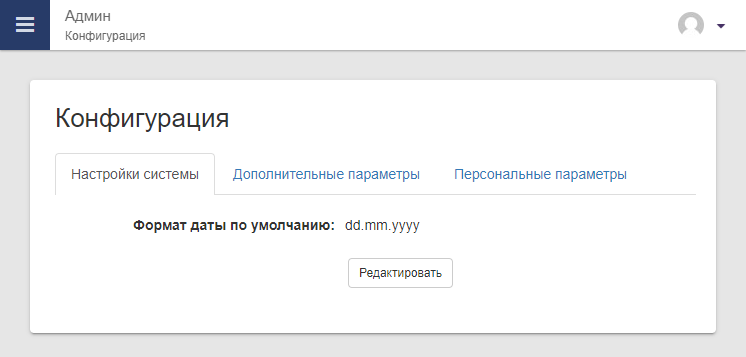
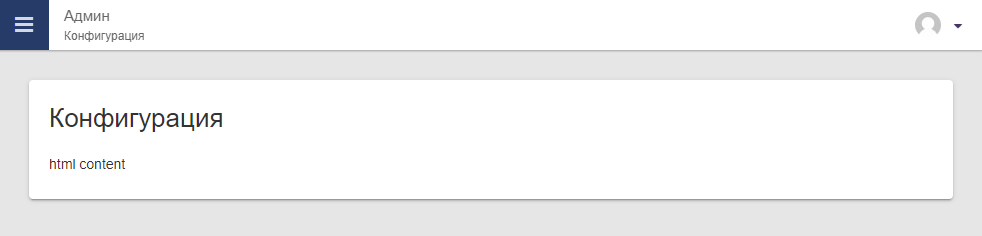
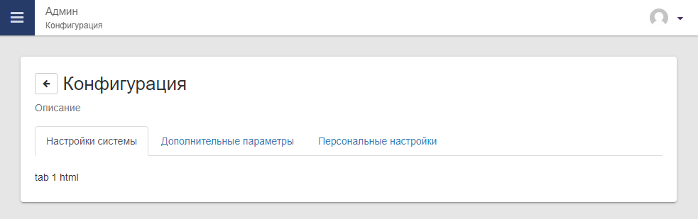
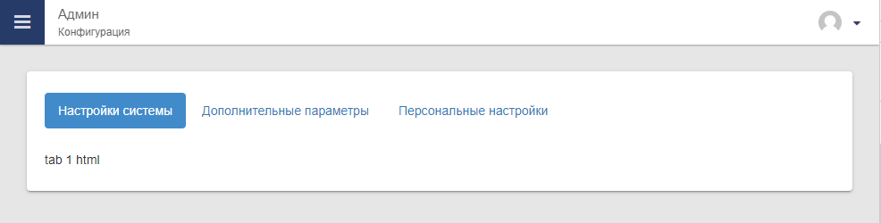
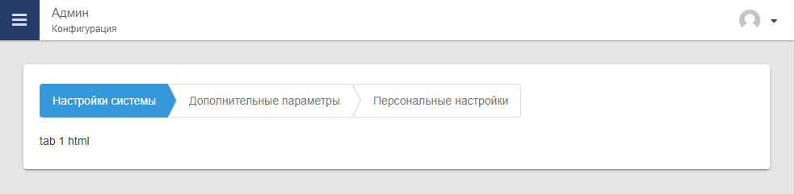
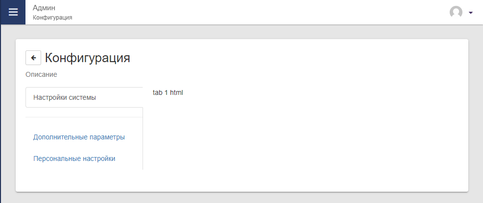
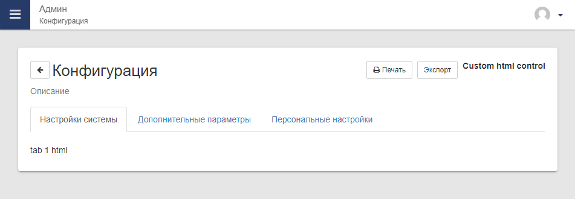

# Класс Panel

Класс предназначен для создания элемента интерфейса `Панель`, на котором будет расположен функционал модуля.

Пример

 
Панель может содержать:

- Заголовок
- Подзаголовок
- Кнопку назад
- Элементы управления (как правило кнопки)
- Табы
- Любой Html внутри тела


## Простая панель



=== "Пример"

    ```php
    require_once DOC_ROOT . 'core2/inc/classes/Panel.php';
    
    $panel = new \Panel();
    $panel->setTitle('Конфигурация');

    $content = 'html content';    

    $panel->setContent($content);
    echo $panel->render();
    ```

=== "С комментариями"

    ```php
    require_once DOC_ROOT . 'core2/inc/classes/Panel.php';
    
    $panel = new \Panel();
    $panel->setTitle('Конфигурация');
    
    $content = 'html content';

    // Установка html содержимого, которое будет показано внутри панели
    $panel->setContent($content);
    
    // Редер html кода панели
    echo $panel->render();
    ```


## Панель с табами



=== "Пример"

    ```php
    require_once DOC_ROOT . 'core2/inc/classes/Panel.php';
    
    $base_url = 'index.php?module=your_mod&action=index';
    $panel    = new \Panel('tab');
    
    $panel->setTitle('Конфигурация', 'Описание', $base_url);
    
    $panel->addTab('Настройки системы',        'system',   $base_url);
    $panel->addTab('Дополнительные параметры', 'extra',    $base_url);
    $panel->addTab('Персональные настройки',   'personal', $base_url);
    
    $content = [];
    
    switch ($panel->getActiveTab()) {
        case 'system':   $content[] = 'tab 1 html'; break;
        case 'extra':    $content[] = 'tab 2 html'; break;
        case 'personal': $content[] = 'tab 3 html'; break;
    }
    
    $panel->setContent(implode('', $content));
    
    echo $panel->render();
    ```

=== "С комментариями"

    ```php
    require_once DOC_ROOT . 'core2/inc/classes/Panel.php';
    
    // Базовый адрес страницы
    $base_url = 'index.php?module=your_mod&action=index';
    
    // Параметр 1 - Идентификатор панели, обязателен при наличии табов
    $panel = new \Panel('tab');
    
    // Параметр 1 - Заголовок
    // Параметр 2 - Подзаголовок, необязательный
    // Параметр 3 - Адрес для кнопки "Назад", необязательный
    $panel->setTitle('Конфигурация', 'Описание', $base_url);
    
    
    // Добавление табов в панель
    // Параметр 1 - Текст таба
    // Параметр 2 - Идентификатор таба  
    // Параметр 3 - Адрес для кнопки "Назад", необязательный
    $panel->addTab('Настройки системы',        'system',   $base_url);
    $panel->addTab('Дополнительные параметры', 'extra',    $base_url);
    $panel->addTab('Персональные настройки',   'personal', $base_url);
    
    $content = [];
    
    // Опредение активного таба по текущему query параметру &tab=system
    switch ($panel->getActiveTab()) {
        case 'system':   $content[] = 'tab 1 html'; break;
        case 'extra':    $content[] = 'tab 2 html'; break;
        case 'personal': $content[] = 'tab 3 html'; break;
    }
    
    // Установка html содержимого, которое будет показано внутри панели
    $panel->setContent(implode('', $content));
    
    // Редер html кода панели
    echo $panel->render();
    ```


## Виды табов

Вид `pills` 



Вид `steps`



=== "Пример"

    ```php
    require_once DOC_ROOT . 'core2/inc/classes/Panel.php';
    
    $base_url = 'index.php?module=your_mod&action=index';
    $panel    = new \Panel('tab');
    
    // TYPE_STEPS
    $panel->setTypeTabs($panel::TYPE_PILLS);

    $panel->addTab('Настройки системы',        'system',   $base_url);
    $panel->addTab('Дополнительные параметры', 'extra',    $base_url);
    $panel->addTab('Персональные настройки',   'personal', $base_url);
    
    $content = [];
    
    switch ($panel->getActiveTab()) {
        case 'system':   $content[] = 'tab 1 html'; break;
        case 'extra':    $content[] = 'tab 2 html'; break;
        case 'personal': $content[] = 'tab 3 html'; break;
    }
    
    $panel->setContent(implode('', $content));
    
    echo $panel->render();
    ```

=== "С комментариями"

    ```php
    require_once DOC_ROOT . 'core2/inc/classes/Panel.php';
    
    // Базовый адрес страницы
    $base_url = 'index.php?module=your_mod&action=index';
    $panel    = new \Panel('tab');
    
    // Параметр 1 - Тип табов из существующих в классе
    // TYPE_STEPS
    $panel->setTypeTabs($panel::TYPE_PILLS);
       
    // Добавление табов в панель
    // Параметр 1 - Текст таба
    // Параметр 2 - Идентификатор таба  
    // Параметр 3 - Адрес для кнопки "Назад", необязательный
    $panel->addTab('Настройки системы',        'system',   $base_url);
    $panel->addTab('Дополнительные параметры', 'extra',    $base_url);
    $panel->addTab('Персональные настройки',   'personal', $base_url);
    
    $content = [];
    
    // Опредение активного таба по текущему query параметру &tab=system
    switch ($panel->getActiveTab()) {
        case 'system':   $content[] = 'tab 1 html'; break;
        case 'extra':    $content[] = 'tab 2 html'; break;
        case 'personal': $content[] = 'tab 3 html'; break;
    }
    
    // Установка html содержимого, которое будет показано внутри панели
    $panel->setContent(implode('', $content));
    
    // Редер html кода панели
    echo $panel->render();
    ```


## Боковые табы



=== "Пример"

    ```php
    require_once DOC_ROOT . 'core2/inc/classes/Panel.php';
    
    $base_url = 'index.php?module=your_mod&action=index';
    $panel    = new \Panel('tab'); 
    $panel->setTitle('Конфигурация', 'Описание', $base_url);

    // POSITION_TOP, POSITION_LEFT, POSITION_RIGHT, POSITION_BOTTOM
    $panel->setPosition($panel::POSITION_LEFT);
    $panel->setWidthTabs(240);

    $panel->addTab('Настройки системы',        'system',   $base_url);
    $panel->addDivider();
    $panel->addTab('Дополнительные параметры', 'extra',    $base_url);
    $panel->addTab('Персональные настройки',   'personal', $base_url);
    
    $content = [];
    
    switch ($panel->getActiveTab()) {
        case 'system':   $content[] = 'tab 1 html'; break;
        case 'extra':    $content[] = 'tab 2 html'; break;
        case 'personal': $content[] = 'tab 3 html'; break;
    }
    
    $panel->setContent(implode('', $content));
    
    echo $panel->render();
    ```

=== "С комментариями"

    ```php
    require_once DOC_ROOT . 'core2/inc/classes/Panel.php';
    
    // Базовый адрес страницы
    $base_url = 'index.php?module=your_mod&action=index';
    $panel    = new \Panel('tab');
    
    // Указание на положение для табов из существующих положений в классе
    // POSITION_TOP, POSITION_LEFT, POSITION_RIGHT, POSITION_BOTTOM
    $panel->setPosition($panel::POSITION_LEFT);

    // Указание на ширину табов в пикселях
    // Нужно для случаев когда текст не помешается в табе или наоборот, текст слишком короткий
    // По умолчанию 200. Работает только с боковыми табами
    $panel->setWidthTabs(240);
       
    // Добавление табов в панель
    // Параметр 1 - Текст таба
    // Параметр 2 - Идентификатор таба  
    // Параметр 3 - Адрес для кнопки "Назад", необязательный
    $panel->setTitle('Конфигурация', 'Описание', $base_url);


    // Добавление табов в панель
    // Параметр 1 - Текст таба
    // Параметр 2 - Идентификатор таба  
    // Параметр 3 - Адрес для кнопки "Назад", необязательный
    $panel->addTab('Настройки системы',        'system',   $base_url);

    // Добавляет разделитель между табами, полезно при большом количестве табов
    // Работает только с боковыми табами
    $panel->addDivider();

    $panel->addTab('Дополнительные параметры', 'extra',    $base_url);
    $panel->addTab('Персональные настройки',   'personal', $base_url);
    
    $content = [];
    
    // Опредение активного таба по текущему query параметру &tab=system
    switch ($panel->getActiveTab()) {
        case 'system':   $content[] = 'tab 1 html'; break;
        case 'extra':    $content[] = 'tab 2 html'; break;
        case 'personal': $content[] = 'tab 3 html'; break;
    }
    
    // Установка html содержимого, которое будет показано внутри панели
    $panel->setContent(implode('', $content));
    
    // Редер html кода панели
    echo $panel->render();
    ```


## Элементы управления



=== "Пример"

    ```php
    require_once DOC_ROOT . 'core2/inc/classes/Panel.php';
    
    $base_url = 'index.php?module=your_mod&action=index';
    $panel    = new \Panel('tab'); 
    $panel->setTitle('Конфигурация', 'Описание', $base_url);

    $panel->addControls('button_1', '<i class="fa fa-print"></i> Печать', 'onclick_btn1_func()');
    $panel->addControls('button_2', 'Экспорт',                            'onclick_btn2_func()');

    $panel->addControlsCustom('<b>Custom html control</b>');

    $panel->addTab('Настройки системы',        'system',   $base_url);
    $panel->addTab('Дополнительные параметры', 'extra',    $base_url);
    $panel->addTab('Персональные настройки',   'personal', $base_url);
    
    $content = [];
    
    switch ($panel->getActiveTab()) {
        case 'system':   $content[] = 'tab 1 html'; break;
        case 'extra':    $content[] = 'tab 2 html'; break;
        case 'personal': $content[] = 'tab 3 html'; break;
    }
    
    $panel->setContent(implode('', $content));
    
    echo $panel->render();
    ```

=== "С комментариями"

    ```php
    require_once DOC_ROOT . 'core2/inc/classes/Panel.php';
    
    // Базовый адрес страницы
    $base_url = 'index.php?module=your_mod&action=index';
    $panel    = new \Panel('tab');

    // Параметр 1 - Заголовок
    // Параметр 2 - Подзаголовок, необязательный
    // Параметр 3 - Адрес для кнопки "Назад", необязательный
    $panel->setTitle('Конфигурация', 'Описание', $base_url);
    

    // Добавление кнопок на панель
    // Параметр 1 - Id кнопки
    // Параметр 2 - Содержимое кнопки, допускается html
    // Параметр 3 - JS функция которая будет выполнена при нажатии
    $panel->addControls('button_1', '<i class="fa fa-print"></i> Печать', 'onclick_btn1_func()');
    $panel->addControls('button_2', 'Экспорт',                            'onclick_btn2_func()');

    // Добавление костомного контрола на панель
    // Может содержать любой html код
    $panel->addControlsCustom('<b>Custom html control</b>');


    // Добавление табов в панель
    // Параметр 1 - Текст таба
    // Параметр 2 - Идентификатор таба  
    // Параметр 3 - Адрес для кнопки "Назад", необязательный
    $panel->addTab('Настройки системы',        'system',   $base_url);
    $panel->addTab('Дополнительные параметры', 'extra',    $base_url);
    $panel->addTab('Персональные настройки',   'personal', $base_url);
    
    $content = [];
    
    // Опредение активного таба по текущему query параметру &tab=system
    switch ($panel->getActiveTab()) {
        case 'system':   $content[] = 'tab 1 html'; break;
        case 'extra':    $content[] = 'tab 2 html'; break;
        case 'personal': $content[] = 'tab 3 html'; break;
    }
    
    // Установка html содержимого, которое будет показано внутри панели
    $panel->setContent(implode('', $content));
    
    // Редер html кода панели
    echo $panel->render();
    ```