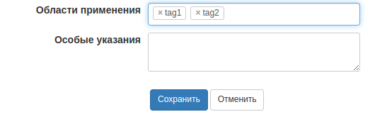

Поле для выбора существующих значений из списка + возможность указать свои значения.
 


#### Пример использования:
```php
$list = [
    'tag1',
    'tag2',
    'tag3',
];

// необязательные параметры
$options = [
    'attr'         => 'style="width: 300px;"',
    'placeholder'  => 'Подсказка'
    'separators'   => [',', ' '],
    'input_length' => 0,
    
    // https://select2.org/data-sources/ajax
    'autocomplete' => [
       'url'      => 'index.php?module=MODULE&action=ACTION&data=MANE',
    ]
];

$edit->addControl('Список', $edit::TYPE_TAGS, $options); $edit->selectSQL[] = $list;
```

#### Пример ответа при использовании autocomplete
```json
{
  "results": [
    {
      "id": 1,
      "text": "Option 1"
    },
    {
      "id": 2,
      "text": "Option 2"
    }
  ]
}
```


#### Пример сохранения результата:
```php

    $data['control']['field_name'] = $data['control']['field_name'] 
        ? json_encode(array_values($data['control']['field_name'])) 
        : null;

```

Подробнее [https://select2.org/tagging](https://select2.org/tagging)
