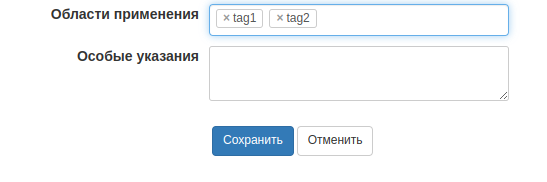

# Поля формы (`Edit`)

Раздел описывает типы полей, которые поддерживаются в `core2/inc/classes/class.edit.php`.

> Источник: ветка рендера в `class.edit.php` (`$value['type'] == ...`).

---

## Быстрый старт

```php
$edit->addControl('Название', 'text');
$edit->addControl('Дата', 'date');
$edit->addControl('Теги', 'tags', [
    'placeholder' => 'Введите значения',
]);
```


## Модификаторы типа

В `type` поддерживаются служебные суффиксы:

- `_hidden` — скрыть поле
- `_auto` — авто-режим (используется внутри `Edit`)
- `_default` — служебный fallback

Пример: `text_hidden`, `date_auto`.

---

## Список поддерживаемых типов

Ниже — типы, встречающиеся в `class.edit.php`.

### Базовые

- `hidden`
- `protect` / `TYPE_PROTECTED` (только чтение)
- `TYPE_CUSTOM` (произвольный HTML)
- `text`, `edit`
- `number`
- `number_range`
- `money`
- `password`
- `textarea`
- `color`
- `link`
- `search`

### Дата / время

- `date`
- `datetime`
- `TYPE_TIME`
- `datetime_local`
- `date_week`
- `date_month`
- `date2`
- `datetime2`
- `daterange`

### Переключатели / выбор

- `radio`
- `radio2`
- `checkbox`
- `checkbox2`
- `TYPE_SWITCH`

### Списки

- `select`
- `list`
- `list_hidden`
- `multilist`
- `select2`
- `multiselect2`
- `multilist2`
- `multilist3`
- `combobox`
- `dataset`
- `tags`

### Модальные и составные

- `modal`
- `modal2`
- `modal_list`

### Файлы

- `file`
- `TYPE_XFILE`
- `TYPE_XFILES`

### Прочее

- `TYPE_COORDINATES`
- `fck*` (варианты редактора, обрабатываются по префиксу `fck`)

---

## `tags` (выбор + свои значения)

Поле для выбора существующих значений из списка + возможность указать свои значения.



### Пример использования

```php
$list = [
    'tag1',
    'tag2',
    'tag3',
];

// необязательные параметры
$options = [
    'attr'         => 'style="width: 300px;"',
    'placeholder'  => 'Подсказка',
    'separators'   => [',', ' '],
    'input_length' => 0,

    // https://select2.org/data-sources/ajax
    'autocomplete' => [
       'url'      => 'index.php?module=MODULE&action=ACTION&data=NAME',
    ]
];

$edit->addControl('Список', $edit::TYPE_TAGS, $options);
$edit->selectSQL[] = $list;
```

### Пример ответа при использовании `autocomplete`

```json
{
  "results": [
    {
      "id": 1,
      "text": "Option 1"
    },
    {
      "id": 2,
      "text": "Option 2"
    }
  ]
}
```

### Пример сохранения результата

```php
$data['control']['field_name'] = $data['control']['field_name']
    ? json_encode(array_values($data['control']['field_name']))
    : null;
```

Подробнее: [https://select2.org/tagging](https://select2.org/tagging)

---

## Рекомендации

- Для новых форм предпочтительнее `select2`/`multiselect2`/`tags`.
- Для диапазонов дат — `daterange`.
- Для файлов с превью/множественной загрузкой — `TYPE_XFILE`/`TYPE_XFILES`.
- Если нужен полностью кастомный HTML-контрол — `TYPE_CUSTOM`.

Если нужно, можно вынести каждый тип в отдельную страницу с параметрами и примерами (`value`, `in`, `attr`, `readonly`, валидация, сохранение в БД).
