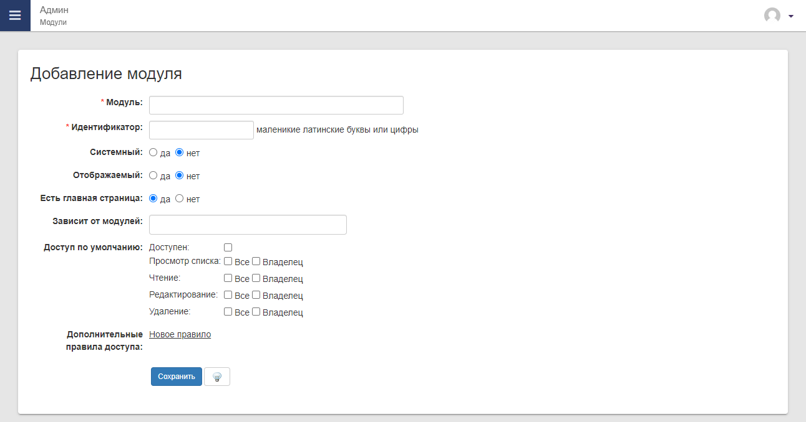
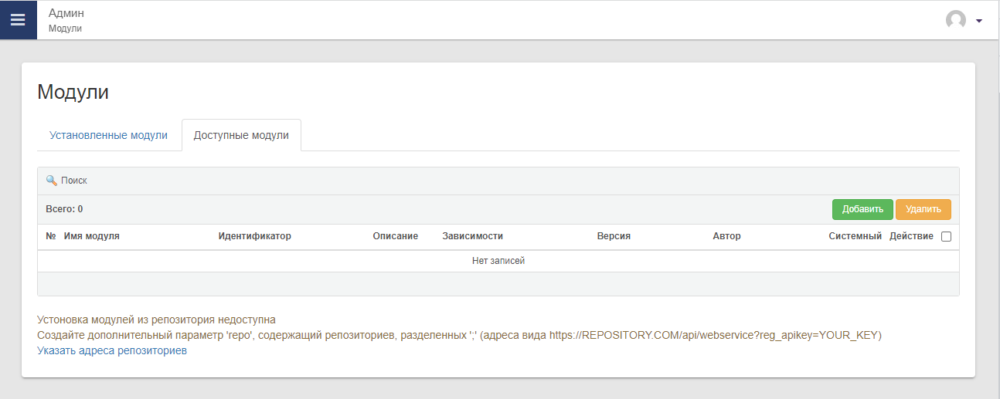
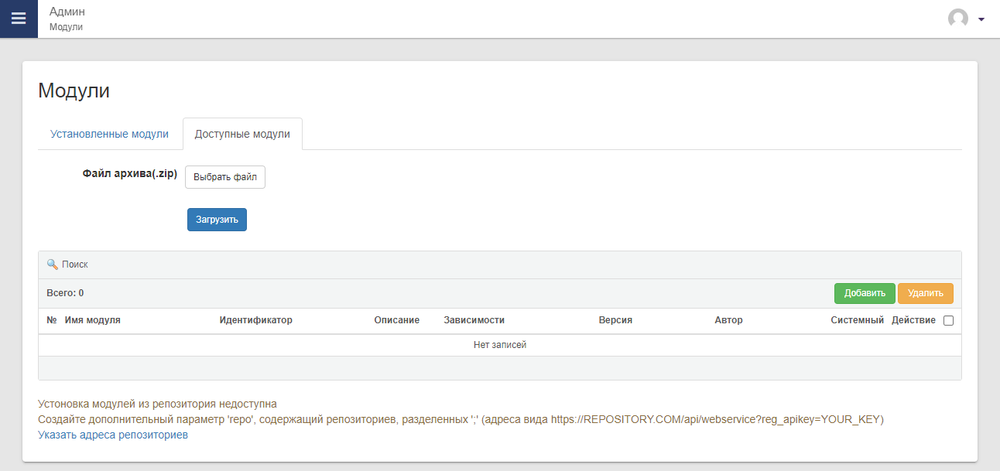
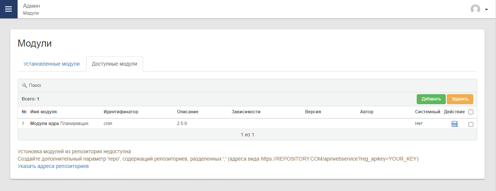
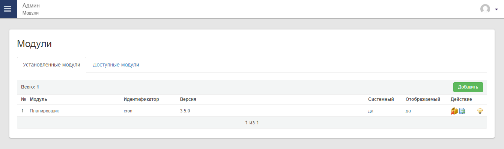

# Управление модулями

## Установка модуля вручную
Для добавления в систему новых модулей необходимо:

1) Открыть модуль `Админ`, раздел `Модули`, появится список установленных в системе модулей
   

2) Нажать на кнопку "Добавить".
   

3) Укажите произвольное название в поле "Модуль". Это название будет видно в меню системы, оно может быть изменить в будущем, в любое время.    

4) Заполните поле "Идентификатор". Это поле нельзя будет изменить в дальнейшем, оно должно соответствовать кодовому названию модуля.

5) Поле "Системный" указывает на расположение файлов модуля. Если модуль будет расположен в папке `core2/mod`, то выберите "Да", если в `mod`, то "нет".     

6) Поле "Отображаемый" указывает на отображение модуля в меню. Если будет выбрано "Нет", то модуль не будет отображаться в меню.

7) Поле "Есть главная страница" указывает на то, будет ли модуль иметь главную страницу, которая будет открываться при нажатии в меню на модуль. Если выбрано "Нет", то будет открываться первый доступный раздел.

8) Поле "Доступ по умолчанию" задает доступы для ролей "По умолчанию"

## Установка модуля из архива

Если у вас есть модуль в виде файла-архива, то его можно установить в системе. Для этого необходимо:

1) Открыть модуль `Админ`, раздел `Модули`, закладка `Доступные модули` появится список доступных модулей из которых можно установить.

2) Нажать на кнопку "Добавить", в открывшейся форме загрузите файл-архив модуля.

3) После успешной загрузки нажмите на иконку "Дискета" для установки загруженного модуля

4) После установки модуль будет доступен в закладке "Установленные модули"

## Удаление модуля

Если установленный модуль более не требуется, то откройте список установленных модулей и удалите его с помощью нажатия на иконку "Коробка с крестиком".

