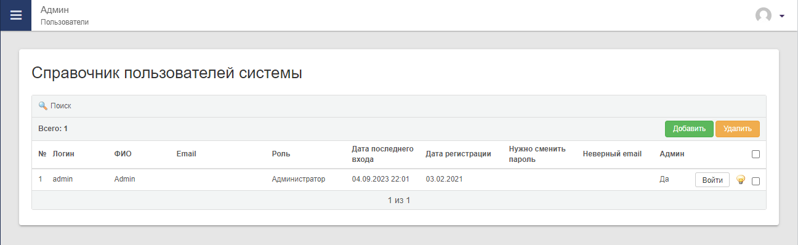
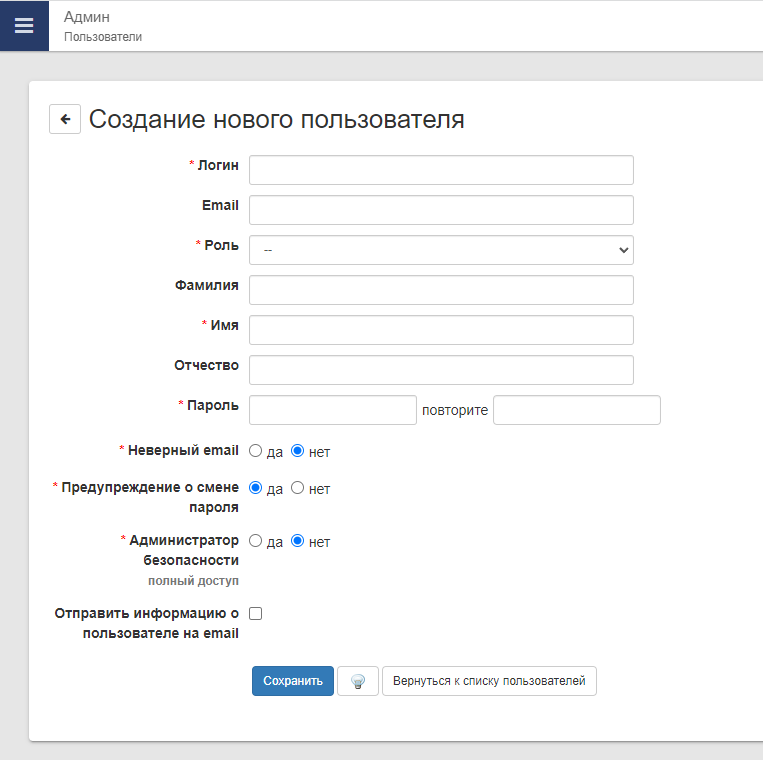
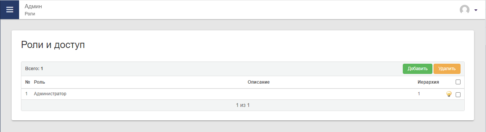
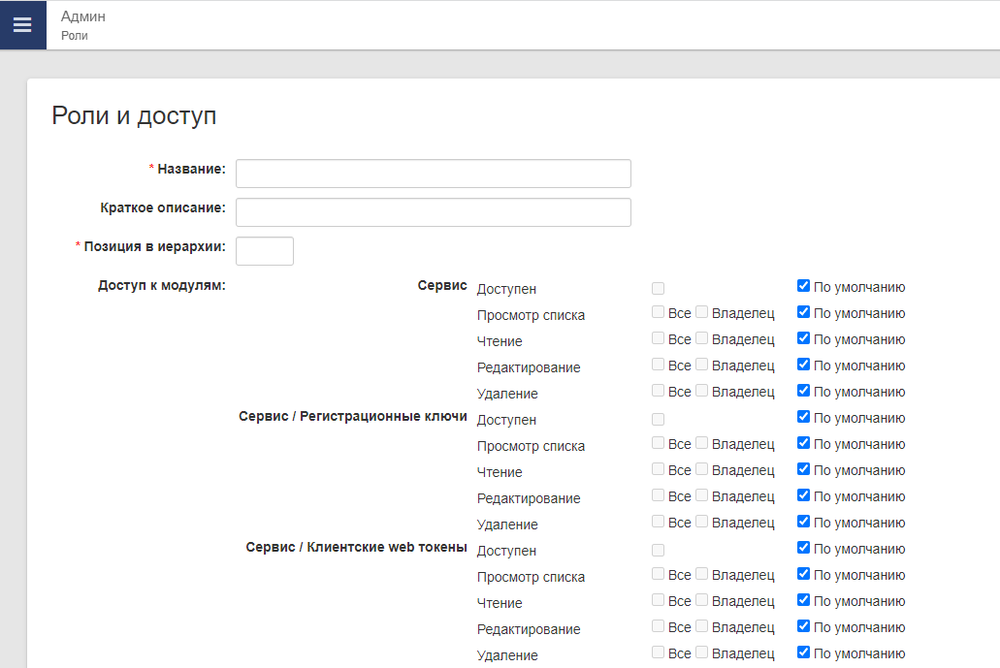

# Пользователи и роли

После установки системы у вас будет только один пользователь администратор со всеми правами - `admin`.  

## Добавление пользователей
Для добавления в систему новых пользователей необходимо:

1) Открыть модуль `Админ`, раздел `Пользователи`, появится список пользователей у которых есть доступ в систему

2) Нажать на кнопку "Добавить". Заполните появившуюся форму и сохраните

Примечание:

- В поле "Роль" находится список ролей из раздела `Роли`, оно определяет права доступа для добавляемого пользователя. 
- Нажмите на кнопку "лампочка" чтобы пользователь был активен.

## Добавление ролей
Для добавления в систему новых ролей необходимо:  

1) Открыть модуль `Админ`, раздел `Роли`, появится список ролей

2) Нажать на кнопку "Добавить".

3) Заполните "Название", оно должно характеризовать пользователей, которые будут иметь эту роль. Например "Сотрудники"

4) Заполните "Позиция в иерархии", по умолчанию установите значение - **1**

5) При наличии установленных модулей в системе задайте права доступа к ним. Они имеют следующую настройку: 

| Значение                    | Описание                                                                                                    |
|-----------------------------|-------------------------------------------------------------------------------------------------------------|
| **Доступен**                | Дает доступ к модулю или разделу модуля, он будет виден в меню                                              |
| **Просмотр списка**         | Дает доступ к спискам внутри модуля. При отсутствии доступа, на месте списка ничего не будет                |
| **Чтение**                  | Дает доступ на просмотр записей списка                                                                      |
| **Редактирование**          | Дает доступ к редактированию записей списка. Чтобы редактировать обязательно должен быть доступ на "Чтение" |
| **Удаление**                | Дает доступ к удалению записей из списка                                                                    |    
| **Пользовательский доступ** | Доступ в модуле к какому либо индивидуальному функционалу этого модуля                                      |    

**По умолчанию** - доступ будет взят из настроек модуля. Как правило все доступы запрещены.

Кроме основных значений доступов у них есть модификаторы:

- **Все** - доступ будет распространяться на все записи, любых авторов. Следует выбрать этот модификатор, если ограничений не требуется.
- **Владелец** - доступ будет только на записи, которые создал пользователь, является их автором. Если в списке модуля нет функционала авторства, то поведение будет идентично модификатору "Все"

