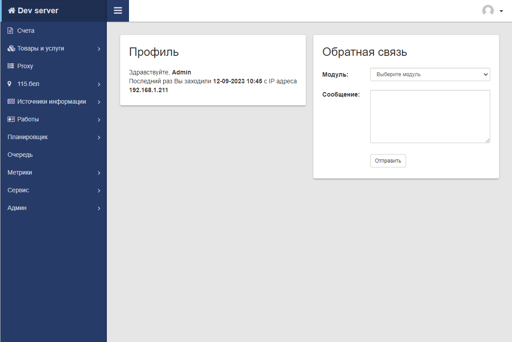
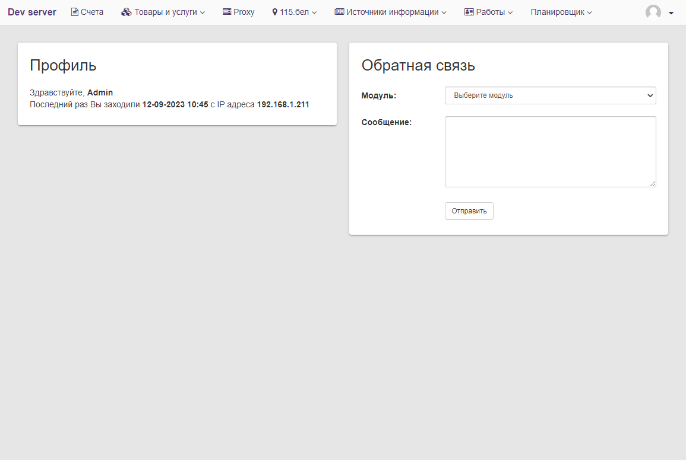
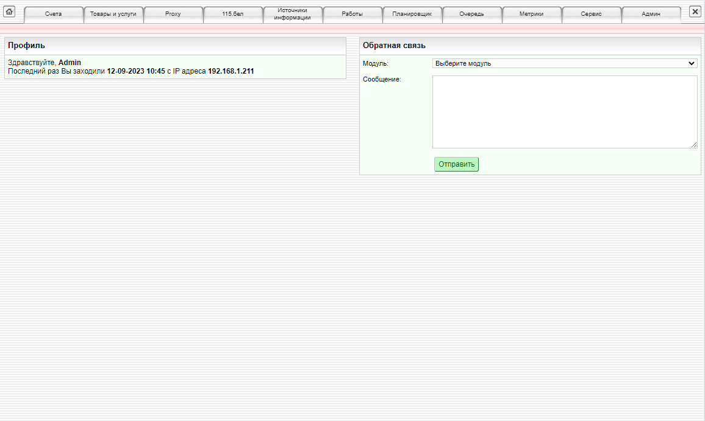

# Настройка

Внутри ядра предустановлено несколько внешних видов для системы. 
Можно выбрать любую, которая больше подходит для каждого отдельного случая.   

Для установки системы требуется указать ее название в конфиге приложения. 
За это отвечает параметр `system.theme.name = material`


## Material

Самый часто используемый внешний вид, подходит для большинства проектов. 
В основе находится framework [Bootstrap v3.4](https://getbootstrap.com/docs/3.4)

При необходимости, для этой темы доступна возможность небольшого изменения цветов боковой панели.
Для этого нужно указать требуемые цвета в конфиге. 
Например так:

```ini
system.theme.name         = material
system.theme.bg_color     = "#273b68"
system.theme.border_color = "#43c0fb"
system.theme.text_color   = "#d2d9e5"
```




## Light

Внешний вид подходит для небольших проектов с малым количество модулей (1-4 шт.).
В основе находится framework [Bootstrap v3.4](https://getbootstrap.com/docs/3.4)





## Default

Базовый внешний вид с самым простым интерфейсом.  




## Своя тема

Доступна возможность создания своих тем внешнего вида. 
Для этого внутри ядра, в директории `core2/html` необходимо создать папку с названием вашей темы и скопировать в нее файлы из любой другой темы.
Поле этого изменить скопированные файлы так, чтобы сделать внешний вид таким, который нужен вам. 
После в конфиге необходимо установить название новой темы по аналогии с вышеуказанными примерами.
Если все сделано верно, то вы увидите свой внешний вид.